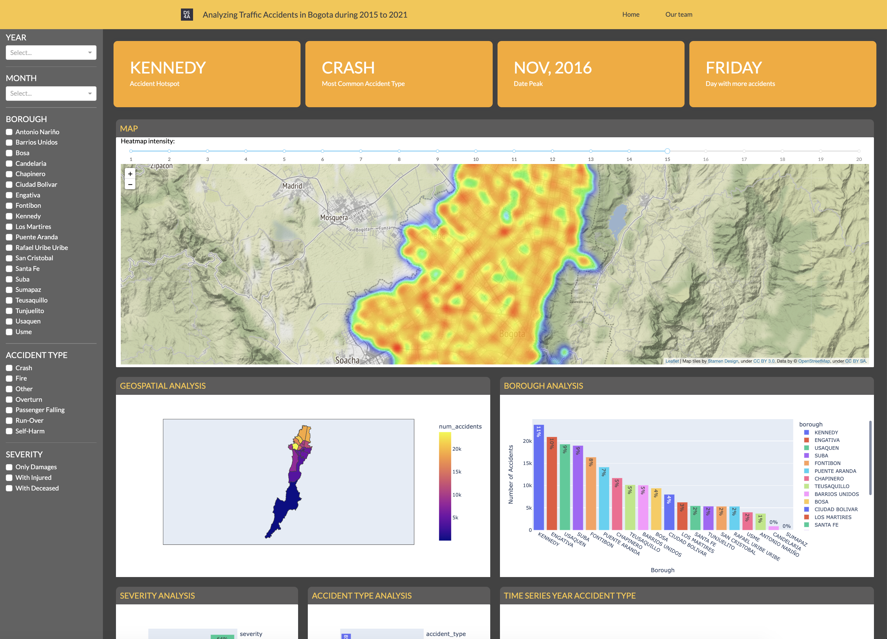

# Bogotá Accidents

## Github repository

https://github.com/luisca1985/DS4A_bogota_accidents

## Prerequisites
- [Install Git](https://git-scm.com/downloads)
- [Install python 3](https://www.python.org/downloads/)
- [Install Docker](https://docs.docker.com/engine/install/)
- [Install Docker Compose](https://docs.docker.com/compose/install/)

## Configurarion
### Start the Project

Clone the project.
odio esto!
```git
git clone git@github.com:luisca1985/DS4A_bogota_accidents.git
```

Access to the folder.

```bash
cd DS4A_bogota_accidents
```

### Create environment variables

Create an `.env` file with:

```
VAR="value of the variable"
```


### Docker
#### Run the application

```
docker-compose up --build
```

Build the images and run the containers in the background.

```
docker-compose up --build -d
```

#### Display logs

Displays log output from services and follows it.

```
docker-compose logs -f
```
F de f 
#### Attach to the application

Attach to the containers.

```
docker-compose up --attach-dependencies
```

##### Stop application

If it is necessary stop the servies:
- Attach to the containers (see above)
- Press `CRTL + C`

#### Conect with prompt

Get an interactive prompt for the application

```
docker-compose exec app bash
```

### Virtual Environment
#### Linux and Mac
Create virtual environment

```bash
python3 -m venv .venv
```

Activate virtual environment

```bash
source .venv/bin/activate
```

Deactivate virtual environment

```bash
deactivate
```
#### Windows

```
pip install virtualenv
```
```
virtualenv .venv
```
```
.venv/Scripts/activate
```
##### Likely problems

1. Execution Policy problem, execute:
    ```
    Set-ExecutionPolicy Unrestricted -Scope Process
    ```

2. Fiona installation problem, download GDAL from
[download GDAL](https://www.lfd.uci.edu/~gohlke/pythonlibs/#gdal)
and then execute
    ```
    pip install c:\Users\........\GDAL‑3.0.4‑cp37‑cp37m‑win32.whl
    ```
    Finally, download Fiona from
    [download Fiona](https://www.lfd.uci.edu/~gohlke/pythonlibs/#fiona)
    and then execute
    ```
    pip install c:\Users\........\Fiona‑1.8.13‑cp37‑cp37m‑win32.whl
    ```


#### Install packages

```bash
pip install -r requirements.txt
```

## Run the Application

Go to the navigator and text

```http
http://0.0.0.0:8050/
```

## As seen on the cloud

http://team82project.inertiasas.com:8050/

